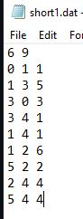
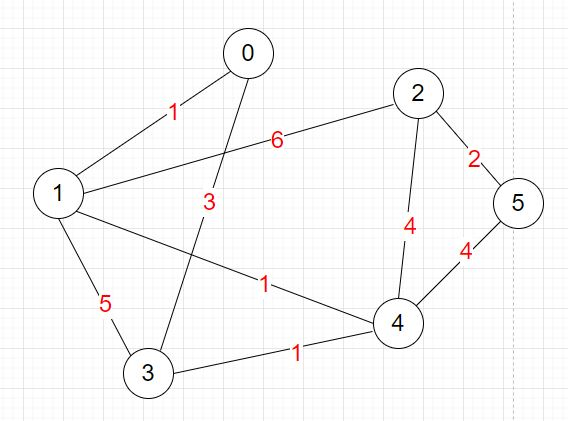
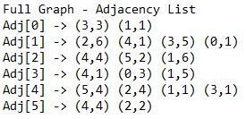
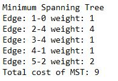
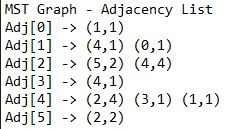
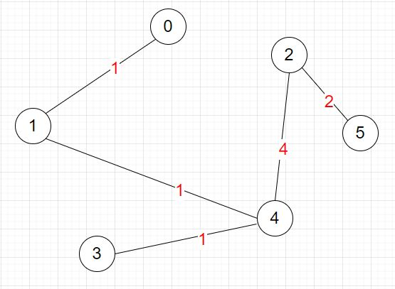
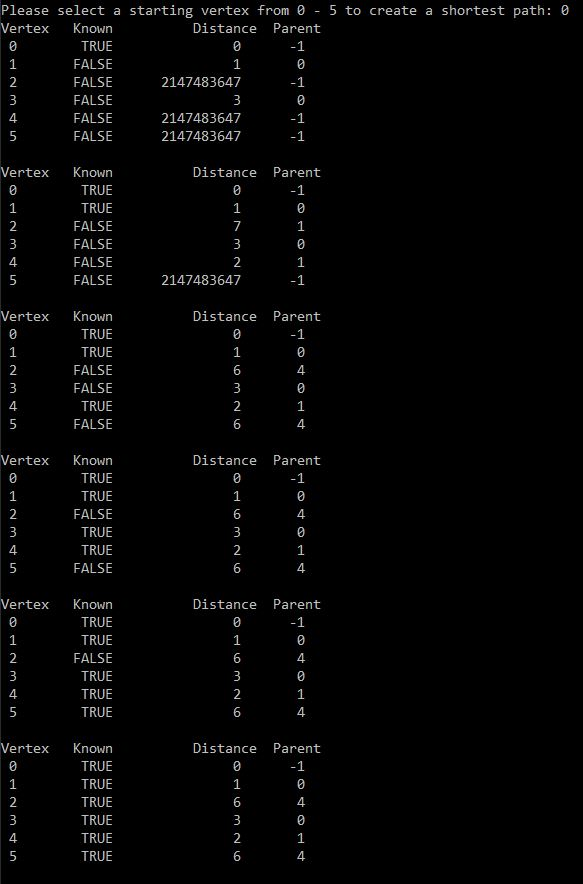
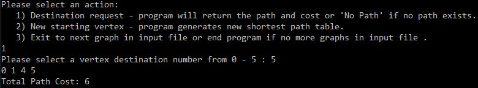

# Prims-Dijkstras-Algo-Example
## MST creation using Prim's MST Algorithm and finding the shortest path using Dijkstra's Algorithm

This program uses data from a file which represents a connected or unconnected, undirected graph. If the graph is weighted with weights representing a cost for that link, it is often desirable to find the minimum weight spanning tree.

* A minimum spanning tree (MST) or minimum weight spanning tree is a subset of the edges of an edge-weighted undirected graph that connects all the vertices together, without any cycles and with the minimum possible total edge weight.

Upon running the program, the user will first be prompted to enter the output file along with the .dat file. In the .dat file, the first line represents the number of vertices and edges for that graph.
The following lines of data represent edges formed from adjacent vertices along with a cost associated with each edge. The first two number represent the vertices that create the edge, and the third number is the cost or weight.

----

***Example using short1.dat:***

 

***Representation of the graph:***

----

**After entering both files, the program outputs to the console and output file:**
* Every edge that was added
* Adjacency List for the full graph

  
  
  **For Example**: *Adj[0] -> (3,3)*. 
  
  For (3,3), the first number is the adjacent vertex, the second number is the edge's weight. So, 0 is adjacent to 3 making an edge and the weight of this edge is 3.
  
  
* The MST for the graph using Prim's Algorithm

  
  
  (see graph below)

* Adjacency List for the MST graph

  
  
  (see graph below)

***Representation of the MST graph:***

----

Next, the user will be prompted to enter a starting vertex, from the available verticies, to create a shortest path to all other verticies. This uses Dijkstra's Shortest Path Algorithm.

Still using the same graph and data (short1.dat), for this example the user selects the 0 vertex as the starting point for the shortest path algorithm.  From the graph representation above, we can see that there are many different paths to reach every vertex from the 0 vertex.
This algorithm will find the shortest distance it takes to reach each vertex. The distance is the sum of all edge costs/weights associated with the path.

The program outputs the steps taken to achieve a shortest path to each vertex.

Then the user will be prompted to select an action:

1. Destination Request

  * The user enters their desired destination vertex from the available vertices and the program outputs the shortest path and total cost to reach the destination vertex.
  
2. New Starting Vertex

  * The user can select a new starting vertex, and the program will generate a new shortest path table sequence like the image shown above.
  
3. Exit to next graph or end program

  * The user can end the program or if there is another graph in the .dat file, the program will start over with the new graph
  
For this example, the user selects a Destination Request. That destination being vertex 5.

From the full graph represenation above, there is no edge connecting the 0 vertex to the 5 vertex. So, we must travel through vertices that connect 0 and 5. 
There are many different paths to vertex 5 but this program finds the shortest distance to our desired destination. 

Here we can see that the shortest path to reach vertex 5 from vertex 0 is: 0 to 1 to 4 to 5

And the shortest distance traveled in order to reach vertex 5 is: 6

